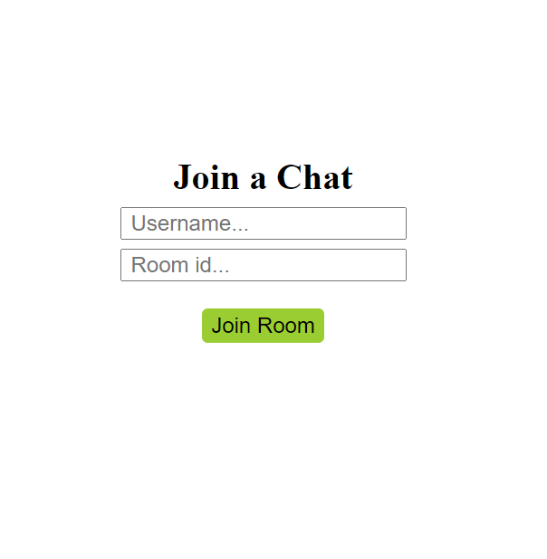
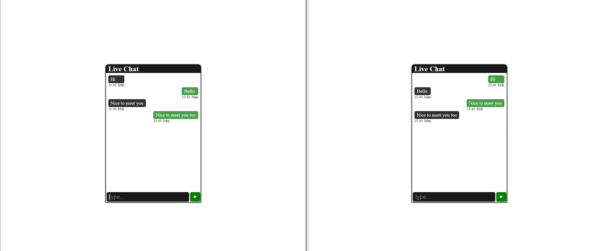

# Real Time Chat App

<p align="center"></p>

<p align="center"></p>

## Server dependencies

- npm i express nodemon socket.io cors

```javascript
  "scripts": {
    "start": "nodemon server.js"
  },
```

## Client dependencies

- npm create vite@latest

- npm i socket.io-client

- npm i react-scroll-to-bottom

## How to run

- Start server: `npm start`

- Start client: `npm run dev`
